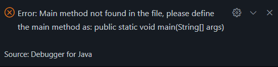

### Nama : Ivansyah Eka Oktaviadi Santoso
### NIM : 2341720126
### Absen : 16
### Kelas : TI-1B

# 2.1 Percobaan 1: Deklarasi Class, Atribut dan Method
## 2.1.1 Langkah-langkah Percobaan
1. Buka  text editor. Buat file baru, beri nama Buku<noAbsen>.java

	     
2 Lengkapi class Buku dengan atribut dan method yang telah digambarkan di dalam class diagram tersebut.

 
## 2.1.2 Verifikasi Hasil Percobaan

<h2>2.1.3 Pertanyaan </h2>

1. Sebutkan dua karakteristik class atau object!
 
Jawaban : <li> a. Atribut : didalam class Buku16.java atributnya adalah judul, pengarang, halaman, stok dan harga </li>
	        <li> b. Method : yang mendefinisikan perilaku objek. Di class Buku16.java method nya adalah tampilInformas(), terjual(int jml), restock(int jml), dan gantiHarga(int hrg).</li>

2. Perhatikan class Buku pada Praktikum 1 tersebut, ada berapa atribut yang dimiliki oleh class Buku? Sebutkan apa saja atributnya!
 
Jawaban : Ada 5 atribut yaitu judul, pengarang, halaman, stok dan harga.

3. Ada berapa method yang dimiliki oleh class tersebut? Sebutkan apa saja methodnya!

Jawaban : Ada 4 method yaitu tampilInformasi(), terjual(int jml), restock(int jml), dan ganti Harga(int hrg) 

4. Perhatikan method terjual() yang terdapat di dalam class Buku. Modifikasi isi method tersebut sehingga proses pengurangan hanya dapat dilakukan jika stok masih ada (lebih besar dari 0)!
 

5. Menurut Anda, mengapa method restock() mempunyai satu parameter berupa bilangan int?

Jawaban : karena dapat digunakan untuk menambah jumlah stok buku dan juga menentukan berapa banyak buku yang akan ditambahkan ke stok. 

6. Commit dan push kode program ke Github! 

# 2.2 Percobaan 2: Instansiasi Object, serta Mengakses Atribut dan Method
## 2.2.1 Langkah-langkah Percobaan
1. Buat file baru, beri nama BukuMain.java

2. Tuliskan struktur dasar bahasa pemrograman Java yang terdiri dari fungsi main() dan Di dalam fungsi main(), lakukan instansiasi, kemudian lanjutkan dengan mengakses atribut dan method dari objek yang telah terbentuk.

 
## 2.2.2 Verifikasi Hasil Percobaan

 
 
## 2.2.3 Pertanyaan 

1. Pada class BukuMain, tunjukkan baris kode program yang digunakan untuk proses instansiasi! Apa nama object yang dihasilkan?

Jawaban : 

2. Bagaimana cara mengakses atribut dan method dari suatu objek? 

Jawaban : mengakses atribut judul dari objek bk1, dengan mengetik bk1.judul . Begitupun Untuk memanggil method tampilInformasi() dari objek bk1, kita dapat mengetik bk1.tampilInformasi()

3. Mengapa hasil output pemanggilan method tampilInformasi() pertama dan kedua berbeda?

Jawaban :  karena ada perubahan pada atribu objek bk1 di antara dua pemanggilan tersebut. Setelah pemanggilan pertama, method terjual(5) dipanggil,  yang mengurangi stok bk1 sebanyak 5. Begitu juga method gantiHarga(60000) dipanggil, yang mengubah harga bk1 menjadi 60000. Dan Ketika tampilInformasi() dipanggil untuk kedua kalinya, ia menampilkan informasi yang telah diperbarui tentang bk1

# 2.3 Percobaan 3: Membuat Konstruktor
## 2.3.1 Langkah-langkah Percobaan 
1. Buka kembali class Buku. Tambahkan dua buah konstruktor di dalam class Buku tersebut, yang terdiri dari satu konstruktor default dan satu konstruktor berparameter. Konstruktor merupakan method Istimewa, penempatan kode program untuk konstruktor dapat diperlakukan sama seperti method yang lain (setelah atribut).

 
2. Buka kembali class BukuMain. Buat sebuah object lagi bernama bk2 dengan menggunakan konstruktor berparameter.

 
3. Compile dan run program.

4. Commit dan push kode program ke Github

## 2.3.2 Verifikasi Hasil Percobaan

 

 
## 2.3.3 Pertanyaan 

1. Pada class Buku di Percobaan 3, tunjukkan baris kode program yang digunakan untuk mendeklarasikan konstruktor berparameter!

Jawaban :  

 

2. Perhatikan class BukuMain. Apa sebenarnya yang dilakukan pada baris program berikut?

Jawaban :  membuat objek baru yaitu bk2 dari class Buku16 menggunakan konstruktor berparameter. Parameter yang diberikan ke konstruktor digunakan untuk menginisialisasi atribut objek bk2.

3. Hapus konstruktor default pada class Buku, kemudian compile dan run program. Bagaimana hasilnya? Jelaskan mengapa hasilnya demikian!

Jawaban :  Terjadinya kesalahan kompilasi pada baris kode yang mencoba untuk membuat objek bk1 menggunakan konstruktor default. 

4. Setelah melakukan instansiasi object, apakah method di dalam class Buku harus diakses secara berurutan? Jelaskan alasannya!
 
Jawaban :  Tidak, karena tidak harus sesuai berurutan tetapi tergantung juga dengan kebutuhan dan logika program yang kita inginkan. 

5. Buat object baru dengan nama buku(nama mahasiswa) menggunakan konstruktor berparameter dari class Buku!

Jawaban :  

6. Commit dan push kode program ke Github

# Latihan Praktikum
1. Pada class Buku yang telah dibuat, tambahkan tiga method yaitu hitungHargaTotal(), 
hitungDiskon(), dan hitungHargaBayar() dengan penjelasan sebagai berikut:

o Method hitungHargaTotal() digunakan untuk menghitung harga total yang merupakan perkalian antara harga dengan jumlah buku yang terjual

o Method hitungDiskon() digunakan untuk menghitung diskon dengan aturan berikut: 

▪ Jika harga total lebih dari 150000, maka harga didiskon sebesar 12% 

 ▪ Jika harga total antara 75000 sampai 150000, maka harga didiskon sebesar 5%
 
<p.>▪ Jika harga total kurang dari 75000, maka harga tidak didiskon</p.> 

o Method hitungHargaBayar() digunakan untuk menghitung harga total setelah dikurangi 
diskon 
Class diagram Buku setelah penambahan ketiga method tersebut adalah sebagai berikut.

2. Penjelasan dari atribut dan method pada class Dragon tersebut adalah sebagai berikut: 
• Atribut x digunakan untuk menyimpan posisi koordinat x (mendatar) dari dragon, sedangkan 
atribut y untuk posisi koordinat y (vertikal) 
• Atribut width digunakan untuk menyimpan lebar dari area permainan, sedangkan height 
untuk menyimpan panjang area 
• Method moveLeft() digunakan untuk mengubah posisi dragon ke kiri (koordinat x akan 
berkurang 1), sedangkan moveRight() untuk bergerak ke kanan (koordinat x akan bertambah 
1). Perlu diperhatikan bahwa koordinat x tidak boleh lebih kecil dari 0 atau lebih besar dari 
nilai width. Jika koordinat x < 0 atau x > width maka panggil method detectCollision() 
• Method moveUp() digunakan untuk mengubah posisi dragon ke atas (koordinat y akan 
berkurang 1), sedangkan moveDown() untuk bergerak ke bawah (koordinat y akan bertambah 1). Perlu diperhatikan bahwa koordinat y tidak boleh lebih kecil dari 0 atau lebih besar dari 
nilai height. Jika koordinat y < 0 atau y > height maka panggil method detectCollision() 
• Method detectCollision() akan mencetak pesan “Game Over” apabila dragon menyentuh 
ujung area permainan.

