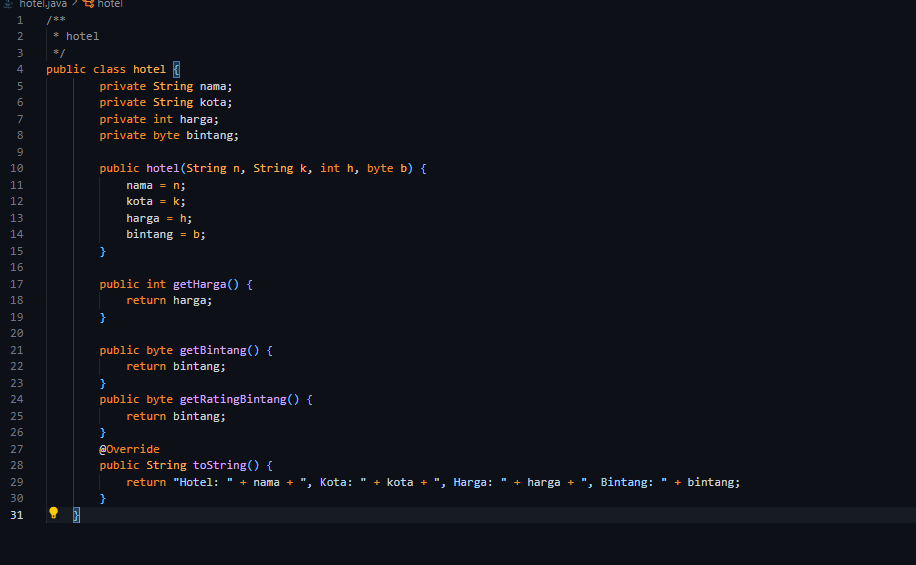

### Nama  : Ivansyah Eka Oktaviadi Santoso
### Kelas  : 1B
### NIM  : 2341720126

# Jobsheet 6 : Sorting (Bubble, Selection, dan Insertion Sort)

## Percobaan 1 : Mengurutkan Data Mahasiswa Berdasarkan IPK Menggunakan Bubble Sort
1. Buat project baru dengan nama “bubble-selection-insertion”, kemudian buat package 
dengan nama “jobsheet6”. 
2. Buatlah sebuah class dengan nama Mahasiswa 
3. Sesuaikan class Mahasiswa dengan melihat class diagram di atas dengan menambahkan 
attribute, konstruktor, dan fungsi atau method. Untuk lebih jelasnya class tersebut dapat 
dilihat pada potongan kode di bawah ini 

4. Buat class DaftarMahasiswaBerprestasi seperti di bawah ini!

5. Tambahkan method tambah() di dalam class tersebut! Method tambah() digunakan 
untuk menambahkan objek dari class Mahasiswa ke dalam atribut listMhs.

6. Tambahkan method tampil() di dalam class tersebut! Method tampil() digunakan untuk 
menampilkan semua data mahasiswa-mahasiswa yang ada di dalam class tersebut! 
Perhatikan penggunaan sintaks for yang agak berbeda dengan for yang telah dipelajari 
sebelumnya, meskipun secara konsep sebenarnya mirip.

 

7. Tambahkan method bubbleSort() di dalam class tersebut!

8. Buat class Main dan didalamnya buat method main() seperti di bawah ini!

9. Di dalam method main(), buatlah sebuah objek DaftarMahasiswaBerprestasi dan 
buatlah 5 objek mahasiswa kemudian tambahkan semua objek mahasiswa tersebut 
dengan memanggil fungsi tambah pada objek DaftarMahasiswaBerprestasi. Silakan 
dipanggil fungsi tampil() untuk melihat semua data yang telah dimasukan, urutkan data 
tersebut dengan memanggil fungsi bubbleSort() dan yang terakhir panggil fungsi tampil 
kembali.

## Verifikasi Hasil Percobaan 1

## Pertanyaan 1
1. Terdapat di method apakah proses bubble sort? 

2. Di dalam method bubbleSort(), terdapat baris program seperti di bawah ini: 

   

Untuk apakah proses tersebut?

<i> jawaban : </i> untuk memastikan bahwa nilai terbesar bergerak ke posisi yang paling kanan setiap iterasi 

3. Perhatikan perulangan di dalam bubbleSort() di bawah ini:

         for(int i=0; i < listMhs.length-1; i++)
          for(int j=1; j < listMhs.length-i; j++)

a. Apakah perbedaan antara kegunaan perulangan i dan perulangan j?  

<i> jawaban : </i> perulangan i digunakan untuk mengakses elemen dengan indeks i, sementara perulangan j digunakan sebagai mengakses elemen dengan indeks j 

b. Mengapa syarat dari perulangan i adalah i<listMhs.length-1 ? 

<i> jawaban : </i> karena kita ingin memastikan bahwa perulangan i hanya berjalan hingga elemen kedua terakhir dalam listMhs. Jika mencapai listMhs.length, akan mengakses indeks yang tidak valid 

c. Mengapa syarat dari perulangan j adalah j<listMhs.length-i ? 

<i> jawaban : </i> karena kita ingin memastikan bahwa perulangan j hanya berjalana hingga elemen terakhir dalam listMhs yang belum diurutkan. 

d. Jika banyak data di dalam listMhs adalah 50, maka berapakali perulangan i  akan 
berlangsung? Dan ada berapa Tahap bubble sort yang ditempuh? 

<i> jawaban : </i> Akan ada 49 kali perulangan dan 49 tahap yang ditempuh

##  Percobaan 2 : Mengurutkan Data Mahasiswa Berdasarkan IPK Menggunakan Selection Sort
1. Lihat kembali class DaftarMahasiswaBerprestasi, dan tambahkan method selectionSort() 
di dalamnya! Method ini juga akan melakukan proses sorting secara ascending, tetapi 
menggunakan pendekatan selection sort.

2. Setelah itu, buka kembali class Main, dan di dalam method main() tambahkan baris 
program untuk memanggil method selectionSort() tersebut! 

3. Coba jalankan kembali class Main, dan amati hasilnya! Apakah kini data mahasiswa telah 
tampil urut menaik berdasar ipk?

## Verifikasi Hasil Percobaan 2
 

## Pertanyaan 2
1. Di dalam method selection sort, terdapat baris program seperti di bawah ini :    
            int idxMin = i;

            for (int j = i + 1; j < listMhs.length; j++){ 

                if (listMhs[j].ipk < listMhs[idxMin].ipk){

                    idxMin = j;

Untuk apakah proses tersebut, jelaskan!

<i> jawaban : </i> proses ini membantu dalam mengatur elemen-elemen array secara terurut, baik itu dalam urutan naik (ascending) maupun turun (descending) tergantung pada implementasi tertentu 

## Percobaan 3 : Mengurutkan Data Mahasiswa Berdasarkan IPK Menggunakan Insertion Sort 
1. Lihat kembali class DaftarMahasiswaBerprestasi, dan tambahkan method insertionSort() 
di dalamnya. Method ini juga akan melakukan proses sorting secara ascending, tetapi 
menggunakan pendekatan Insertion Sort. 

2. Setelah itu, buka kembali class Main, dan di dalam method main() tambahkan baris 
program untuk memanggil method insertionSort() tersebut!

3. Coba jalankan kembali class Main, dan amati hasilnya! Apakah kini data mahasiswa telah 
tampil urut menaik berdasar ipk? 

## Verifikasi Hasil Percobaan 3

## Pertanyaan 3
Ubahlah fungsi pada InsertionSort sehingga fungsi ini dapat melaksanakan proses sorting 
dengan cara descending.

## Latihan Praktikum 
Sebuah platform travel yang menyediakan layanan pemesanan kebutuhan travelling sedang 
mengembangkan backend untuk sistem pemesanan/reservasi akomodasi (penginapan), salah 
satu fiturnya adalah menampilkan daftar penginapan yang tersedia berdasarkan pilihan filter 
yang diinginkan user. Daftar penginapan ini harus dapat disorting berdasarkan  
1. Harga dimulai dari harga termurah ke harga tertinggi.  
2. Rating bintang penginapan dari bintang tertinggi (5) ke terendah (1)  
Buatlah proses sorting data untuk kedua filter tersebut dengan menggunakan algoritma 
bubble sort dan selection sort. 

